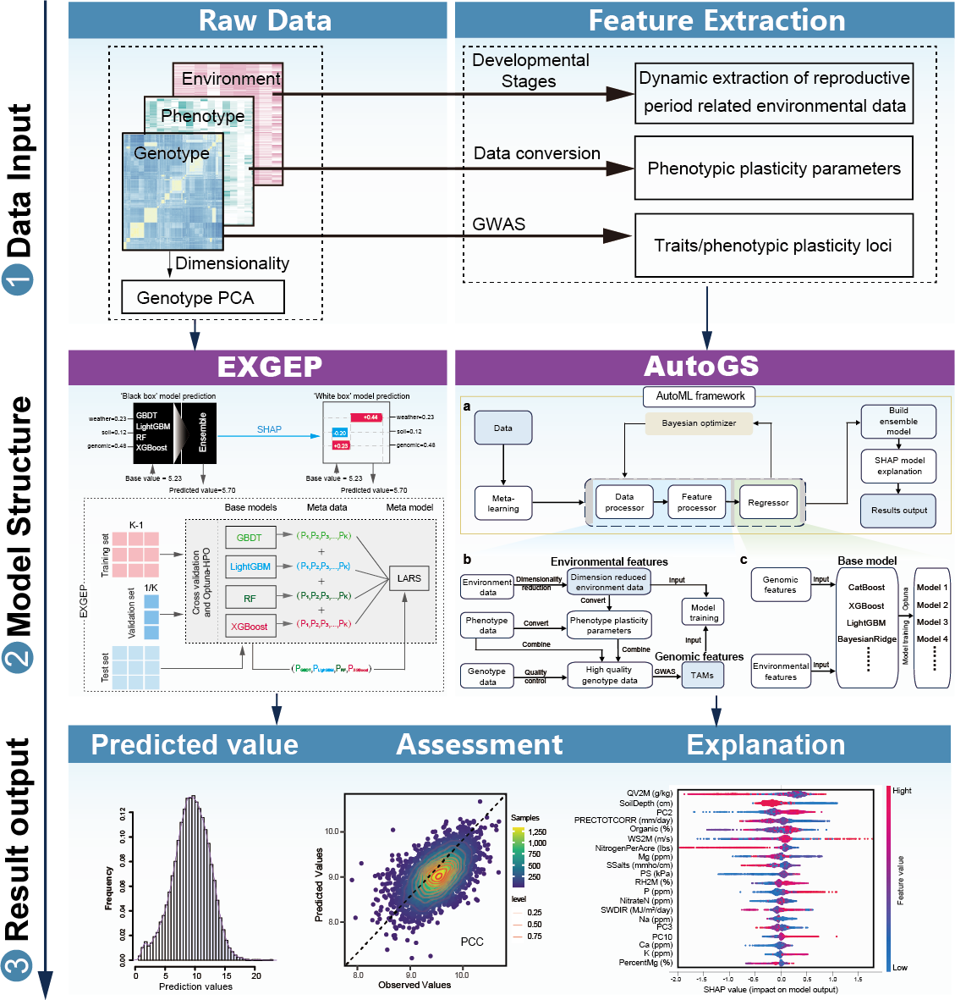

# GxEtoolkit-AutoGS&EXGEP [](./LICENSE) [](https://www.python.org/downloads/release/python-390/) []() [](https://doi.org/10.1002/advs.202412423) [](https://doi.org/10.1002/advs.202412423) [](https://doi.org/10.1093/bib/bbaf414) [](https://doi.org/10.1093/bib/bbaf414)
## An automated and explainable machine learning framework for Genome Prediction

<p align="center">

</a>
</p>

## 🏁Table of Contents
- [Getting started](#Getting-started)
- [Basic Usage](#Basic-Usage)

### Getting started

### Requirements
 
 - Python 3.9
 - pip

### Installation
Install packages:
1. Create a python environment.
```bash
conda create -n gxe python=3.9
conda activate gxe
```
2. Clone this repository and cd into it.
```bash
git clone https://github.com/AIBreeding/ShapGxE.git
cd ./ShapGxE
pip install -r requirements.txt
```
### Basic Usage

AutoGS & EXGEP can be used from the command line or as a Python package. Choose the appropriate framework based on your needs. To run with your own data, make sure it follows the structure of the example datasets.
#### 1. You can use the following commands to check the Command line parameters for AutoGS and EXGEP:
```bash
python main.py autogs -h
python main.py exgep -h
```
#### 2.  Running EXGEP: Example command
```bash
python main.py exgep \
  --geno ./dataset/exgep_data/genotype.csv \
  --phen ./dataset/exgep_data/pheno.csv \
  --soil ./dataset/exgep_data/soil.csv \
  --weather ./dataset/exgep_data/weather.csv \
  --n_traits 1 \
  --target_trait Yield \
  --models_optimize LightGBM \
  --models_assess LightGBM \
  --metric_assess mae,mse,rmse,pcc,r2 \
  --metric_optimise r2 \
  --n_trial 2 \
  --n_splits 2 \
  --write_folder ./exgep_results/ \
  --reload_study \
  --reload_trial \
  --shap_n_train_points 200 \
  --shap_n_test_points 200 \
  --shap_cluster True \
  --shap_model_name LightGBM
```
#### 3.  Running AutoGS: Example command with SHAP-based feature importance analysis
```bash
python main.py autogs \
  --cv_type KFold \
  --phen_file ./dataset/autogs_data/trainset/Pheno/ \
  --env_file ./dataset/autogs_data/trainset/Env/ \
  --geno_file ./dataset/autogs_data/trainset/Geno/YI_All.vcf \
  --ref_file ./dataset/docs/maizeRef(ALL).csv \
  --file_names ./dataset/env.txt \
  --models_optimize LightGBM,XGBoost \
  --models_assess LightGBM,XGBoost \
  --metric_assess mae,mse,rmse,pcc,r2 \
  --metric_optimise r2 \
  --n_trial 2 \
  --n_traits 9 \
  --target_trait Yield_Mg_ha \
  --shap_n_train_points 200 \
  --shap_n_test_points 200 \
  --shap_cluster True \
  --shap_model_name LightGBM
```
#### 4.  Running AutoGS: Example command for model training under LOECV, STECV, and LOESTCV strategies
```bash
python main.py autogs \
  --cv_type STECV \  # LOECV, LOESTCV, STECV
  --phen_file ./dataset/autogs_data/trainset/Pheno/ \
  --env_file ./dataset/autogs_data/trainset/Env/ \
  --geno_file ./dataset/autogs_data/trainset/Geno/YI_All.vcf \
  --ref_file ./dataset/docs/maizeRef(ALL).csv \
  --file_names ./dataset/env.txt \
  --n_traits 9 \
  --target_trait Yield_Mg_ha \
  --base_models KNN,XGBoost,LightGBM \
  --meta_model ridge \
  --is_ensemble \
  --do_optimize \
  --n_trial 2 \
  --metric_assess pcc,rmse \
  --metric_optimise r2 \
  --optimization_objective maximize \
  --write_folder ./autogs_LOECV/
```
#### 5.  Usage as a Python package: You can use our framework to perform prediction tasks using only genotypic features or any other single type of data.
```python
import pathlib
import os
import sys
import pprint
import sklearn
import pandas as pd
import numpy as np
from scipy.stats import pearsonr
from matplotlib import pyplot as plt
from sklearn.preprocessing import StandardScaler

os.getcwd()
project_root = pathlib.Path(__file__).parent.parent.resolve()
sys.path.insert(0, str(project_root))

from autogs.model import RegAutoGS
from autogs.data.tools.reg_metrics import (mae_score as mae,
                             mse_score as mse,
                             rmse_score as rmse,
                             r2_score as r2,
                             rmsle_score as rmsle,
                             mape_score as mape,
                             medae_score as medae,
                             pcc_score as pcc)

your_phen_file_path =  "/dataset/trainset/Pheno/"
your_geno_file_path = "/dataset/trainset/Geno/YI_All.vcf"

phen = pd.read_csv(your_phen_file_path)
geno = pd.read_csv(your_geno_file_path)

scaler = StandardScaler()
scaled_geno = scaler.fit_transform(geno)
X = pd.DataFrame(scaled_geno,columns=geno.columns)
y = pd.core.series.Series(phen)

# train AutoGS model for reg prediction
reg = RegAutoGS(
    y=y,
    X=X, 
    test_size=0.2, 
    n_splits=2, 
    n_trial=2, 
    reload_study=True,
    reload_trial=True, 
    write_folder=os.getcwd()+'/autogs_results/', 
    metric_optimise=r2, 
    metric_assess=[mae, mse, rmse, pcc, r2, rmsle, mape, medae],
    optimization_objective='maximize', 
    models_optimize=['LightGBM','XGBoost'], 
    models_assess=['LightGBM','XGBoost'], 
    early_stopping_rounds=3, 
    random_state=2024
)
reg.train() # train model
# You can interpret either the final AutoGS ensemble model or a specific base model of interest.
reg.CalSHAP(n_train_points=200,n_test_points=200,cluster=False, model_name='XGBoost') # cal SHAP value

```

## Supported Evaluation Metrics
- `mae` — Mean Absolute Error (MAE)
- `mse` — Mean Squared Error (MSE)
- `rmse` — Root Mean Squared Error (RMSE)
- `r2` — R² Score (Coefficient of Determination)
- `rmsle` — Root Mean Squared Logarithmic Error (RMSLE)
- `mape` — Mean Absolute Percentage Error (MAPE)
- `medae` — Median Absolute Error (MedAE)
- `pcc` — Pearson Correlation Coefficient (PCC)

## 🔍 Supported Base Regression Models

The framework currently supports **28 base regression models**, including ensemble models, linear models, and other widely-used regressors. Each model can be optionally selected via the `selected_regressors` list.

### 🌲 Tree Models
- `DTR` – Decision Tree Regressor  
- `ETR` – Extra Trees Regressor  
- `LightGBM` – Light Gradient Boosting Machine  
- `XGBoost` – Extreme Gradient Boosting  
- `CatBoost` – Categorical Boosting  
- `AdaBoost` – Adaptive Boosting  
- `GBDT` – Gradient Boosting Decision Tree  
- `Bagging` – Bagging Regressor  
- `RF` – Random Forest Regressor  
- `HistGradientBoosting` – Histogram-based Gradient Boosting

### 📈 Linear and Sparse Models
- `BayesianRidge` – Bayesian Ridge Regression  
- `LassoLARS` – Lasso Least Angle Regression  
- `ElasticNet` – Elastic Net Regression  
- `SGD` – Stochastic Gradient Descent Regressor  
- `Linear` – Ordinary Least Squares Linear Regression  
- `Lasso` – Lasso Regression  
- `Ridge` – Ridge Regression  
- `OMP` – Orthogonal Matching Pursuit  
- `ARD` – Automatic Relevance Determination Regression  
- `PAR` – Passive Aggressive Regressor  
- `TheilSen` – Theil-Sen Estimator  
- `Huber` – Huber Regressor  
- `KernelRidge` – Kernel Ridge Regression  
- `RANSAC` – RANSAC (RANdom SAmple Consensus) Regressor

### 🔍 Other Models
- `KNN` – k-Nearest Neighbors Regressor  
- `SVR` – Support Vector Regressor  
- `Dummy` – Dummy Regressor (Baseline)  
- `MLP` – Multi-Layer Perceptron (Deep Neural Network)

## 📚 Citation

You can read our paper explaining AutoGS and EXGEP.

He K, Yu T, Gao S, et al. Leveraging Automated Machine Learning for Environmental Data-Driven Genetic Analysis and Genomic Prediction in Maize Hybrids. *Adv Sci (Weinh)*, e2412423, 2025. https://doi.org/10.1002/advs.202412423

Yu T, Zhang H, Chen S, et al. EXGEP: a framework for predicting genotype-by-environment interactions using ensembles of explainable machine-learning models. *Brief Bioinform*, 2025. https://doi.org/10.1093/bib/bbaf414


## 📜Copyright and License
This project is free to use for non-commercial purposes - see the [LICENSE](LICENSE) file for details.

## 👥Contacts
For more information, please contact with **Huihui Li** (lihuihui@caas.cn).
